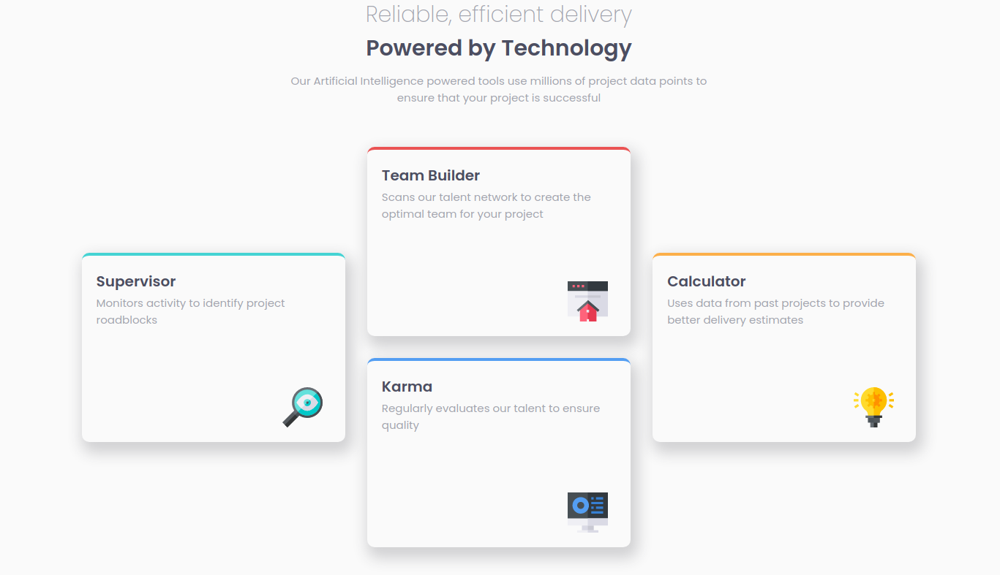

# Frontend Mentor - Four card feature section solution

This is a solution to the [Four card feature section challenge on Frontend Mentor](https://www.frontendmentor.io/challenges/four-card-feature-section-weK1eFYK). Frontend Mentor challenges help you improve your coding skills by building realistic projects. 

## Table of contents

- [Overview](#overview)
  - [The challenge](#the-challenge)
  - [Screenshot](#screenshot)
  - [Links](#links)
- [My process](#my-process)
  - [Built with](#built-with)
  - [What I learned](#what-i-learned)
- [Author](#author)

## Overview

### The challenge

Users should be able to:

- View the optimal layout for the site depending on their device's screen size

### Screenshot

### Links

- Solution URL: [Add solution URL here](https://github.com/spotted76/mentor-four-cards)
- Live Site URL: [Add live site URL here](https://spotted76.github.io/four-cards/)

## My process

### Built with

- Semantic HTML5 markup
- CSS custom properties
- Flexbox
- CSS Grid
- Mobile-first workflow

### What I learned

Leaned in to grid a little more.  Actually switched from grid to flex when going from desktop to mobile layout.  These seemed to work really well, and minimized the amount of css changes for the media query.

Leveraged background image for the cards, seemed to be the easiest way to go.

## Author

- Frontend Mentor - [@yourusername](https://www.frontendmentor.io/profile/spotted76)
- Twitter - [@yourusername](https://www.twitter.com/spotted)
